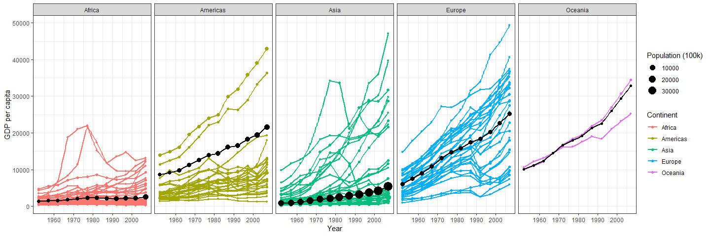

```r
# Use this R-Chunk to import all your datasets!
library(gapminder)
```

## Background

The reading made a lot of sense and helped organize the ideas involved in using ggplot2, but I definitely had to use the internet for additional research. The reading did not cover much about labels and sizing, and so Google was a good resource to clear that up. My code may not be perfect, and there are still a few things I couldn't quite figure out. Still, one of the highlights of making these plots was in realizing, in plot 2, that each line needed to be grouped by country. Before doing this my lines were all over the place, and I couldn't figure out why.

#### Data Wrangling

For a much better viewing experience, refer to the image files of each plot (uploaded seperately - they're close by).


```r
# Use this R-Chunk to clean & wrangle your data!

gapminder1 <- gapminder %>%
  mutate(pop_100k = pop/100000)

gapminder2 <- gapminder %>%
  filter(country != "Kuwait") %>%
  group_by(year, continent) %>%
  mutate(pop_100k = pop/100000, weightedGDP = weighted.mean(gdpPercap, pop_100k), 
         weightedpop = sum(as.numeric(pop_100k)))
```

## Images


```r
# Use this R-Chunk to plot & visualize your data!

plot1 <- ggplot(data = gapminder1, 
                mapping = aes(x = lifeExp, y = gdpPercap, color = continent, size = pop_100k)) +
  geom_jitter() +
  facet_grid(. ~ year) +
  scale_y_continuous(trans = "sqrt") + 
  coord_cartesian(ylim = c(0, 50000)) +
  scale_size(range = c(1.5, 7)) +
  labs(x = "Life Expectancy", y = "GDP per capita", size = "Population (100k)") +
  theme_bw()
plot1
```

<!-- -->

```r
ggsave("plot1.png", plot = plot1, width = 15, height = 5, units = "in")
```


```r
plot2 <- ggplot(data = gapminder2) +
  geom_point(mapping = aes(x = year, y = gdpPercap, 
                           color = continent, size = pop_100k)) +
  geom_line(mapping = aes(x = year, y = gdpPercap, 
                          color = continent, group = country), size = 1) +
  geom_point(mapping = aes(x = year, y = weightedGDP, size = weightedpop)) +
  geom_line(mapping = aes(x = year, y = weightedGDP), size = 1) +
  facet_grid(. ~ continent) +
  coord_trans(limy = c(-2000, 52000)) +
  labs(x = "Year", y = "GDP per capita", 
       size = "Population (100k)", color = "Continent") +
  theme_bw()
plot2
```

<!-- -->

```r
ggsave("plot2.png", plot = plot2, width = 15, height = 5, units = "in")
```

