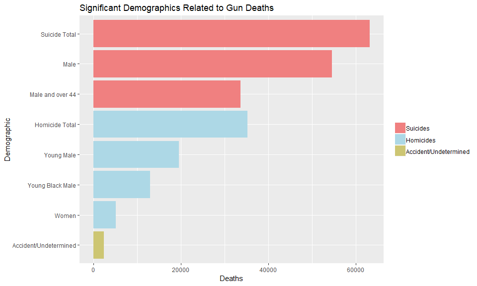
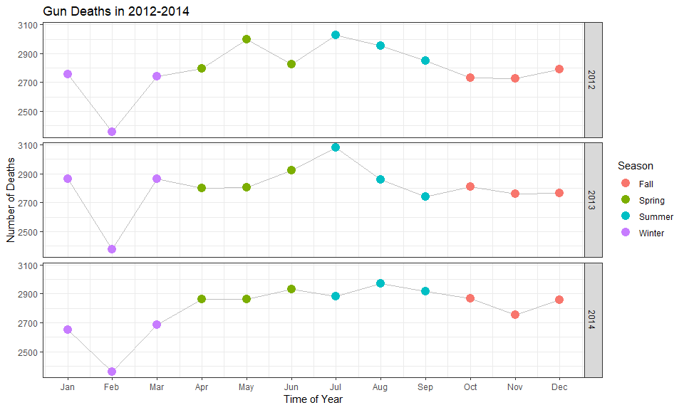
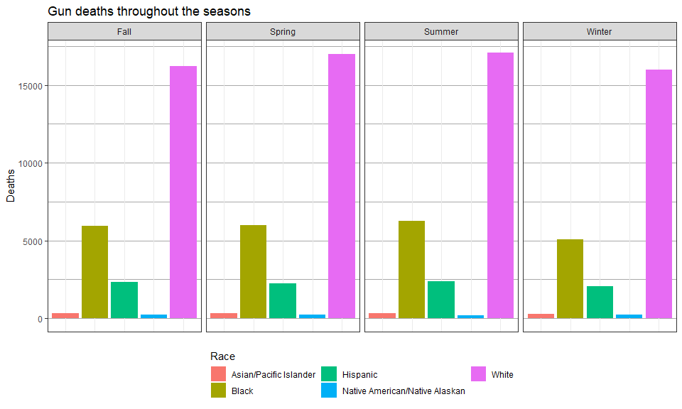
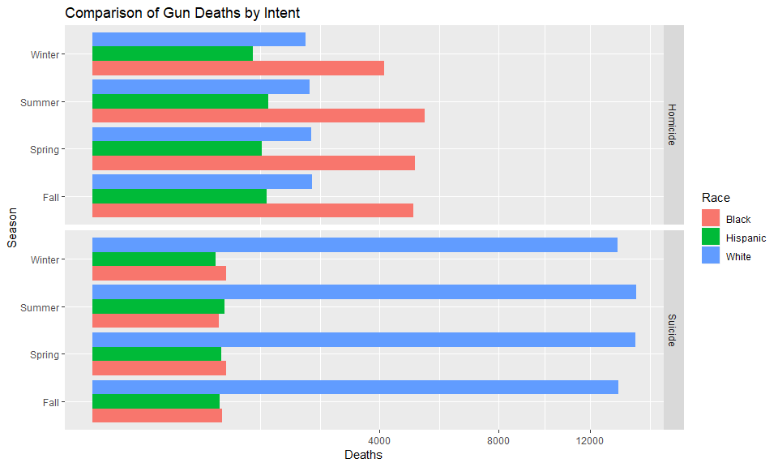
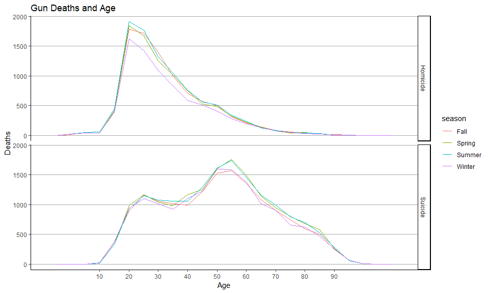

```r
library(tidyverse)
guns <- read_csv("https://github.com/fivethirtyeight/guns-data/raw/master/full_data.csv")
```

## Background

The world is a dangerous place. During 2015 and 2016 there was a lot of discussion in the news about police shootings. FiveThirtyEight reported on gun deaths in 2016. As leaders in data journalism, they have posted a clean version of this data in their GitHub repo called full_data.csv for us to use.

While their visualizations focused on yearly averages, our client wants to create commercials that help reduce the gun deaths in the US. They would like to target the commercials in different seasons of the year (think month variable) to audiences that could have the most impact in reducing gun deaths. Our challenge is to summarize and visualize seasonal trends accros the other variables in these data.

\n

### Re-interpret the gun deaths visualization from the webpage

The text portion of the article from FiveThirtyEight was mainly to describe where their data came from. They also explained a few details about their presentation, such as defining "young males" to be between ages 15 and 34. The presentation itself did a wonderful job of breaking down the number of gun deaths into suicides, homicides and accidents (etc.). They then broke down each subset even further to show some significant statistics, such us the proportion of suicides that are committed by men, and the number of homicides that resulted in the deaths of young, black men.

The visual I created shows the same groups and demographics that the article did. However, while their figures came from averages between the years 2012-2014, the figures in my graphic represent the total numbers over this 3 year period. The way in which they broke down gun deaths into groups is shown in the bar chart below.


```r
# create dataframe with summary values from the website
gunsum <- data.frame(group = c("Suicide Total", "Male", "Male and over 44",
                               "Homicide Total", "Young Male", "Young Black Male",
                               "Women", "Accident/Undetermined"), value = rep(NA,8))
gunsum$value[1] <- guns %>%
  filter(intent %in% "Suicide") %>%
  nrow()
gunsum$value[2] <- guns %>%
  filter(intent %in% "Suicide", sex %in% "M") %>%
  nrow()
gunsum$value[3] <- guns %>%
  filter(intent %in% "Suicide", sex %in% "M", age > 44) %>%
  nrow()
gunsum$value[4] <- guns %>%
  filter(intent %in% "Homicide") %>%
  nrow()
gunsum$value[5] <- guns %>%
  filter(intent %in% "Homicide", sex %in% "M", between(age, 15, 34)) %>%
  nrow()
gunsum$value[6] <- guns %>%
  filter(intent %in% "Homicide", sex %in% "M", race %in% "Black", between(age, 15, 34)) %>%
  nrow()
gunsum$value[7] <- guns %>%
  filter(intent %in% "Homicide", sex %in% "F", age > 14) %>%
  nrow()
gunsum$value[8] <- guns %>%
  filter(intent %in% "Accidental" | intent %in% "Undetermined") %>%
  nrow()

# get the order and colors right
order <- factor(gunsum$group, levels = gunsum$group)
groups <- factor(c(rep("Suicides",3), rep("Homicides", 4), "Accident/Undetermined"))
colors <- c("Suicides" = "lightcoral", "Homicides" = "lightblue", 
            "Accident/Undetermined" = "khaki3")

# barchart of the summary
gunsum %>%
  ggplot(aes(x = group, y = value)) +
  geom_bar(stat = "identity", aes(fill = groups)) +
  scale_x_discrete(limits = rev(levels(order))) +
  scale_fill_manual("groups", values = colors) +
  guides(fill = guide_legend(reverse = TRUE)) +
  labs(title = "Significant Demographics Related to Gun Deaths", x = "Demographic",
       y = "Deaths") +
  theme(legend.title = element_blank()) +
  coord_flip()
```

<!-- -->

\n

### Article: "Effectively Communicating Numbers""

The article “Effectively Communicating Numbers" provided some good tips on how to best visualize data and what not to do. I think I gained the most from the section on better comparing values by changing the axis limits, or "zooming in" on the data. One interesting insight I found is that when doing this with a bar chart, the graph may lose some of its integrty and intelligibility because the bars will not start at zero. To avoid this confusion, if you need to narrow the scale, it is better to re-encode the data as points or glyphs, which will allow a better comparison of the categories without misconstruing with bars that do not show their entire length. Another great insight was in regards to legends. Even the placement and appearance of the legend can increase intelligibility (or detract from the data). For instance, in a horizontally faceted bar chart, the legend keys are much easier to reference when they are placed horizontally along the top of the graph, as opposed to a box on the side.

\n

### Further data exploration


```r
guns$month <- parse_integer(guns$month)
guns <- guns %>%
  mutate(season = case_when(month %in% 1:3 ~ "Winter",
                            month %in% 4:6 ~ "Spring",
                            month %in% 7:9 ~ "Summer",
                            month %in% 10:12 ~ "Fall"))
```


```r
lineplot <- guns %>%
  mutate(season = case_when(month %in% 1:3 ~ "Winter",
                            month %in% 4:6 ~ "Spring",
                            month %in% 7:9 ~ "Summer",
                            month %in% 10:12 ~ "Fall")) %>%
  group_by(month, year, season) %>%
  summarise(count = n()) %>%
  ggplot(aes(x = month, y = count)) +
  geom_line(aes(group = year), color = "gray") +
  geom_point(aes(color = season), size = 4) +
  facet_grid(year ~ .) +
  scale_x_continuous(breaks = 1:12, labels = c("Jan", "Feb", "Mar", "Apr", "May", "Jun", 
                                "Jul", "Aug", "Sep", "Oct", "Nov", "Dec")) +
  labs(title = "Gun Deaths in 2012-2014", x = "Time of Year", 
       y = "Number of Deaths", color = "Season") +
  theme_bw()

lineplot
```

<!-- -->

This graph shows gun deaths over time and shows a distinction between seasons. It looks like there might be a slight increase in gun deaths during the Spring and Summer, but generally there doesn't appear to be a significant difference between seasons. Interestingly, there is a dramatic decrease in the number of deaths during the month of February (likely because it is a shorter month).

----


```r
guns %>%
  ggplot() +
  geom_bar(aes(x = race, fill = race)) +
  facet_grid(. ~ season) +
  theme_bw() +
  theme(panel.grid.major.y = element_line(color = "darkgray"), 
        panel.grid.minor = element_line(color = "darkgray"),
        axis.text.x = element_blank(),
        axis.ticks.x = element_blank(),
        legend.position = "bottom",
        legend.direction = "vertical") +
  labs(title = "Gun deaths throughout the seasons",
       x = NULL, y = "Deaths", fill = "Race") +
  guides(fill = guide_legend(nrow = 2))
```

<!-- -->

This barchart summarises gun deaths throughout the seasons for each race. We see that for each season the bars look very similar, telling us that season is a fairly insignificant factor even when comparing races. 

----


```r
guns %>%
  filter(race %in% c("White", "Black", "Hispanic"), intent %in% c("Suicide", "Homicide")) %>%
  group_by(intent, race, season) %>%
  count() %>%
  na.omit() %>%
  ggplot(aes(x = season, y = n, fill = race)) +
  geom_bar(position = "dodge", stat = "identity") +
  scale_y_continuous(trans = "sqrt") +
  coord_flip() +
  facet_grid(intent ~ .) +
  labs(title = "Comparison of Gun Deaths by Intent", 
       x = "Season", y = "Deaths", fill = "Race")
```

<!-- -->

Here we investigate further into any differences between seasons noticed above. There is a slight increase in white suicides in the warmer seasons, and a decrease in black homicides in the winter.

----


```r
guns %>%
  filter(intent %in% c("Homicide", "Suicide")) %>%
  ggplot(aes(color = season)) + 
  geom_freqpoly(aes(x = age), binwidth = 5) +
  facet_grid(intent ~ .) +
  scale_x_continuous(breaks = seq(10,90,10)) +
  labs(title = "Gun Deaths and Age", 
       x = "Age",
       y = "Deaths") +
  theme_classic() +
  theme(panel.grid.major.y = element_line(color = "darkgray"))
```

<!-- -->

This figure shows how gun deaths vary by age for homicides and suicides, while still comparing by season. We can see the different trends in age and how these trends differ by intent. However, the lines representing each season follow each other very closely in each plot, once again indicating gun deaths don't change much according to season. 

### Conclusions
Time of year (i.e. the seasons) are not a particularly significant factor that influences gun deaths. Any effort to reduce gun deaths would most likely be more effective if geared toward certain demographics and under different contexts (such as white males commiting more suicide and more black deaths due to homicide). Time of year only seems somewhat influential in the fact that there slightly more gun deaths overall during the summer time, and less in the winter. This may be more evident among black homicides. 

\n

yea boi

\n
