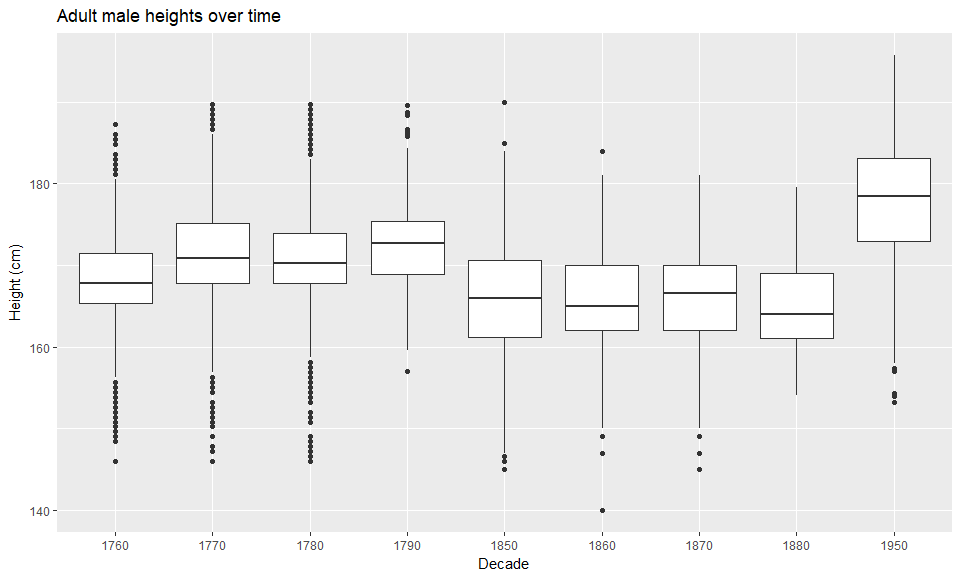

```r
library(tidyverse)
library(haven)
library(readr)
library(readxl)
library(foreign)
```

### Background
The Scientific American argues that humans have been getting taller over the years. As the data scientists that we are becoming, we would like to find data that validates this concept. Our challenge is to show different male heights across the centuries.

This project is not as severe as the two quotes below, but it will give you a taste of pulling various data and file formats together into “tidy” data for visualization and analysis. You will not need to search for data as all the files are listed here

- “Classroom data are like teddy bears and real data are like a grizzly bear with salmon blood dripping out its mouth.” - Jenny Bryan
- “Up to 80% of data analysis is spent on the process of cleaning and preparing data” - Hadley Wickham

#### Data import and tidying


```r
# read worldwide data
ww.height <- read_xlsx("Height.xlsx", skip = 1, col_names = TRUE)

# tidy worldwide data
ww.height.tidy <- ww.height %>%
  gather(key = "year", value = "height", '1800':'2011') %>%
  mutate(decade = gsub(".$", "0", year),
         year = parse_integer(year)) %>%
  rename(region = `Continent, Region, Country`)
```


```r
# read other data
german.con <- read_dta("germanconscr.dta")
german.pris <- read_dta("germanprison.dta")
german.south <- read.dbf("Heights_south-east/B6090.DBF")
bls.heights <- read_csv("heights.csv")
```


```r
# tidy other data
german.con.tidy <- german.con %>%
  select(bdec, height) %>%
  rename(birth_year = bdec, height.cm = height) %>%
  mutate(height.in = height.cm*0.393701, study_id = "german.con")

german.pris.tidy <- german.pris %>%
  select(bdec, height) %>%
  rename(birth_year = bdec, height.cm = height) %>%
  mutate(height.in = height.cm*0.393701, study_id = "german.pris")

german.south.tidy <- german.south %>%
  select(SJ, CMETER) %>%
  rename(birth_year = SJ, height.cm = CMETER) %>%
  mutate(height.in = height.cm*0.393701, study_id = "german.south")

bls.heights.tidy <- bls.heights %>%
  filter(sex %in% "male") %>%
  rename(height.in = height) %>%
  mutate(birth_year = 1950, height.cm = height.in*2.54, study_id = "bls.heights") %>%
  select(birth_year, height.cm, height.in, study_id)

# combine tidy data
tidy.heights <- bind_rows(german.con.tidy, german.pris.tidy, german.south.tidy, bls.heights.tidy)
```

### Analysis


```r
# jitterplot w/ germany highlighted
ww.height.tidy %>%
  filter(!is.na(height)) %>%
  mutate(height.in = height*0.393701) %>%
  ggplot(aes(x = decade, y = height.in)) +
  geom_jitter(aes(color = region=='Germany')) +
  scale_color_manual(values = c('gray', 'red')) +
  labs(title = "Worldwide heights of men, germany highlighted",
       x = "Decade", y = "Height (inches)", color = "Germany") +
  theme_bw() +
  theme(axis.text.x = element_text(angle = 45, hjust = 1))
```

<!-- -->


```r
# frequency plot
tidy.heights %>% 
  ggplot(aes(x=height.in)) + 
  geom_freqpoly(bins = 50) + 
  facet_wrap(~study_id, scales = "free_y", ncol = 1) + 
  theme_bw() + 
  labs(title = "Distribution of Adult Male Heights", x = "Height (inches)", y = "Count")
```

<!-- -->


```r
tidy.heights %>%
  mutate(decade = gsub(".$", "0", birth_year)) %>%
  ggplot(aes(x = decade, y = height.cm)) +
  geom_boxplot() + 
  labs(title = "Adult male heights over time", x = "Decade", y = "Height (cm)")
```

<!-- -->

$~$

The first plot shows a strong trend in increasing heights over the years. There is more of a spread in more recent years, so surely there are some people who are as short as the average person in the 17th century. But there is also a much greater world population today than a few hundred years ago, so this greater spread isn't surprising. The boxplots seem to tell a slightly different story. It looks like in the latter half of the 16th century, men were taller than in the 1800s. But the final boxplot shows a much higher distribution of heights in the 1950s. The lack of a well-defined upward trend in heights in this display may be due to the lack of data, as there are large gaps of missing data, such as in from 1890 to 1940. The first plot shows that there is indeed an upward trend in heights during this time. 

$~$
