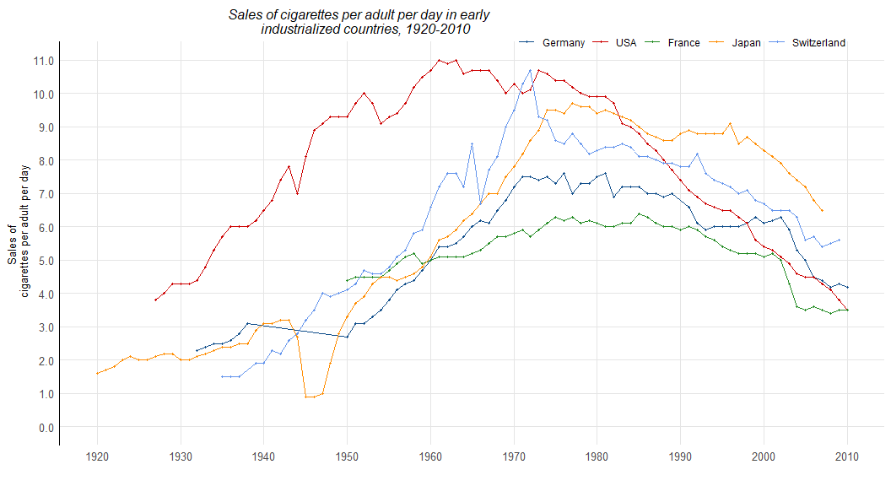
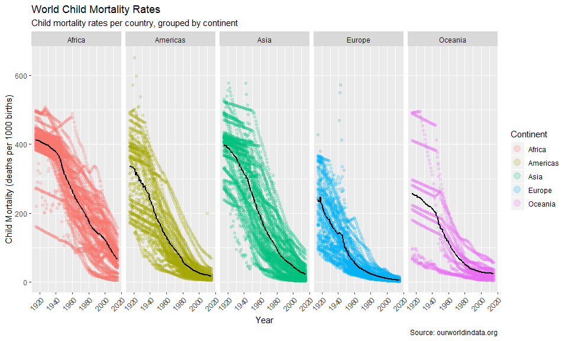
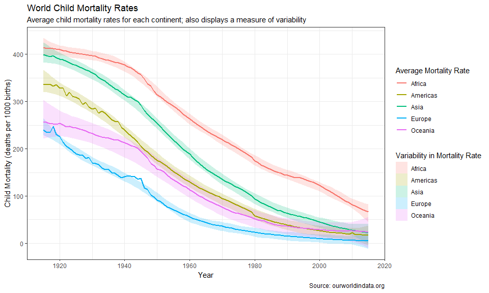

```r
# Use this R-Chunk to import all your datasets!
smoking <- read_csv("Smoking_Since1920.csv")
```

### Background

The Our World in Data website has world data. It is nice that they have provided graphics and then the data that they used to generate the graphics. We are going to recreate some of their visualizations in R and then make them better.


```r
# Use this R-Chunk to clean & wrangle your data!
avg_mort <- child_mortality %>%
  filter(!is.na(child_mort), !is.na(continent), year >= 1915) %>%
  group_by(year, continent) %>%
  summarise(avg = mean(child_mort, na.rm = TRUE))

smokingmelt <- melt(data = smoking, id.vars = c("year"), 
                    variable.name = "country")
```

### Data Visualization

##### Plot 1
I chose this plot because it looked very clean and reproducible, while still presenting challenges involving the layout/theme. It shows smoking trends for five countries from 1920-2010. The metric used to show smoking trends is sales of cigarettes per adult per day. The graph shows a similar trend across all countries where sales gradually rose and then began to decline again between the 70s and 80s.

The graphics were easy to reproduce, but I spent considerable time trying to get the subtle nuances of labels, legends, grid lines, etc. just right. There are some things I have yet to figure out, such as specifying legend key symbols, boldfacing specific values in the axes, and titles that do wrap into two lines.


```r
# Use this R-Chunk to plot & visualize your data!

scaleFUN <- function(x) sprintf("%.1f", x)

plot1 <- smokingmelt %>%
  filter(!is.na(value)) %>%
  ggplot(mapping = aes(x = year, y = value, color = country)) +
  geom_line(size = .4) +
  geom_point(size = .8) +
  scale_color_manual(values = c("dodgerblue4", "red3", "forestgreen", 
                                "darkorange", "cornflowerblue"), 
                     guide = guide_legend(override.aes = list(shape = rep(16, 5)))) +
  labs(title = "Sales of cigarettes per adult per day in early 
       industrialized countries, 1920-2010", x = "", y = "Sales of 
       cigarettes per adult per day", color = "") +
  coord_fixed(ratio = 4, xlim = c(1920,2010), ylim = c(0, 11)) +
  scale_y_continuous(breaks=seq(0.0,11.0,1.0), labels = scaleFUN) +
  scale_x_continuous(breaks=seq(1920,2010,10)) +
  theme_minimal() +
  theme(panel.grid.major = element_line(color = "gray90", size = .1), 
        panel.grid.minor = element_blank(), 
        axis.line.y = element_line(size = .6), 
        axis.text = element_text(size = 10),
        axis.title.y = element_text(size = 10),
        plot.title = element_text(size = 12, face = "italic", hjust = .3),
        legend.position = c(.75,1), legend.direction = "horizontal")

plot1
```

<!-- -->

##### Plot 2
This is the visual I chose to create from the child mortality data set. It shows child mortality rates over the past century across the world. Each facet represents a world region (or continent), showing a scatterplot of mortality rates for each country within that region. The black lines show the average child mortality for each world region. There are hundreds of countries, and so the choice of a scatterplot shows the general trends of each region as a whole, and not so much the trend of any particular country. However, because of the denseness of the plots, some individual country's trends can be seen. The general trend is the same across the entire world - a steep decline in child mortality rates.


```r
plot2 <- child_mortality %>%
  filter(!is.na(child_mort), !is.na(continent), year >= 1915) %>%
  ggplot(aes(x = year, y = child_mort)) +
  geom_point(aes(color = continent), size = 1.3, alpha = .2) +
  geom_line(data = avg_mort, aes(x = year, y = avg, group = continent),
            size = 1) +
  facet_grid(. ~ continent) +
  guides(color = guide_legend(override.aes = list(size=4))) +
  labs(title = "World Child Mortality Rates", 
       subtitle = "Child mortality rates per country, grouped by continent", 
       x = "Year", 
       y = "Child Mortality (deaths per 1000 births)", 
       color = "Continent", 
       group = "Average Mortality Rate",
       caption = "Source: ourworldindata.org") +
  theme(axis.text.x = element_text(angle = 45, hjust = 1))

plot2
```

<!-- -->

##### Plot 3
I made this third plot because I wasn't entirely satisfied with the previous one. This one attempts to convey the same information - the decline in child mortality rates over time worldwide. Instead of showing the variation in mortality rates by showing individual countries' trends, this plot gives a confidence band for the average mortality rate for each continent. For easier comparison, the five trends are condensed into the same plot.


```r
plot3 <- child_mortality %>%
  filter(!is.na(child_mort), !is.na(continent), year >= 1915) %>%
  ggplot() +
  geom_smooth(aes(x = year, y = child_mort, fill = continent), 
              level = 0.99999, linetype = "blank", alpha = 0.2) +
  geom_line(data = avg_mort, aes(x = year, y =avg, color = continent), size = 1) +
  theme_bw() +
  labs(title = "World Child Mortality Rates", 
       subtitle = "Average child mortality rates for each continent; also displays a measure of variability", 
       x = "Year", y = "Child Mortality (deaths per 1000 births)", 
       color = "Average Mortality Rate", fill = "Variability in Mortality Rate",
       caption = "Source: ourworldindata.org")

plot3
```

<!-- -->


\

