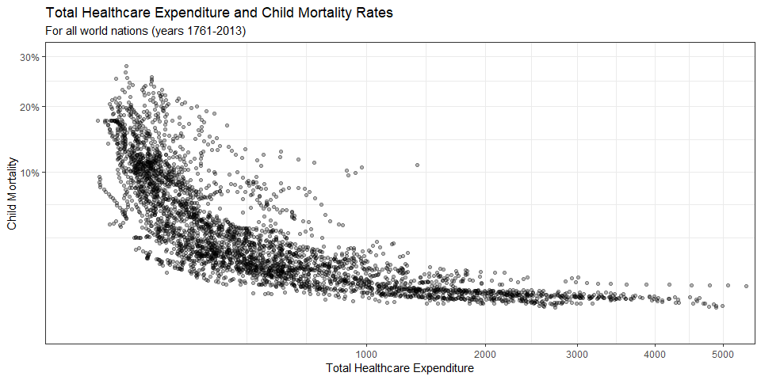
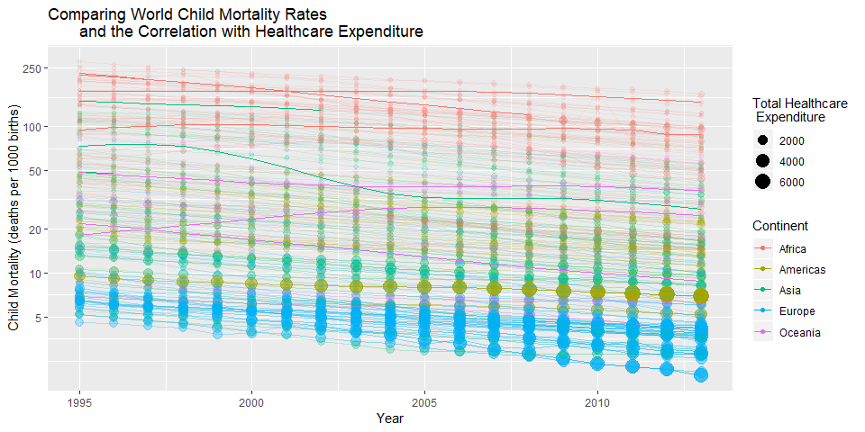

\


This first plot shows the relationship between total healthcare expenditure and child mortality. As you might expect, child mortality rates decrease as the nation spends more on healthcare.


```r
financing_healthcare %>%
  mutate(childmort = child_mort/1000) %>%
  ggplot(aes(x = health_exp_total, y = childmort)) +
  geom_point(alpha = 0.3) +
  coord_cartesian(xlim = c(0, 5000), ylim = c(0, 0.3)) +
  scale_x_continuous(trans = "sqrt") +
  scale_y_continuous(trans = "sqrt", labels = scales::percent) +
  theme_bw() +
  labs(title = "Total Healthcare Expenditure and Child Mortality Rates",
       subtitle = "For all world nations (years 1761-2013)",
       x = "Total Healthcare Expenditure", y = "Child Mortality")
```

<!-- -->


\


Here I wanted to show this same trend but also include information on child mortality rates in general over the past few decades (when healthcare data became available). Each line represents a country, color-coded by continent, with size/transparancy representing healthcare expenditure. We can see that in general, child mortality rates are decreasing with time. Europe has the lowest mortality rates, followed by what is presumably the U.S. Larger, darker points occupy the lower parts of the plot and decrease as mortality rates increase towards the upper region of the plot, indicating the aforementioned relationship between mortality rates and healthcare expenditure. 


```r
financing_healthcare %>%
  filter(!is.na(continent), between(year, 1995, 2013)) %>%
ggplot(aes(x = year, y = child_mort, color = continent, alpha = health_exp_total)) +
  geom_point(aes(size = health_exp_total)) +
  geom_line(aes(group = country)) +
  scale_y_continuous(trans = "log", breaks = c(5, 10, 20, 50, 100, 250)) +
  labs(title = "Comparing World Child Mortality Rates 
       and the Correlation with Healthcare Expenditure",
       x = "Year", y = "Child Mortality (deaths per 1000 births)", color = "Continent", 
       size = "Total Healthcare \n Expenditure") +
  guides(alpha = FALSE)
```

<!-- -->


\

