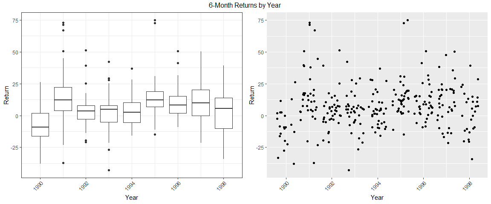
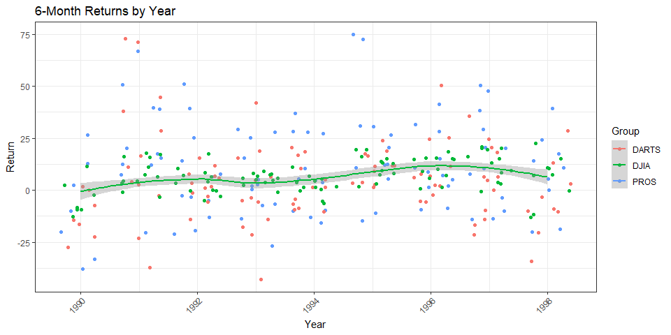

## Background

With stock return data from the previous task, we need to tidy this data for the creation of a time series plot. We want to look at the returns for each six-month period of the year in which the returns were reported. Your plot should highlight the tighter spread of the DJIA as compared to the other two selection methods (DARTS and PROS). We need to display a table of the DJIA returns with months on the rows and years in the columns (i.e. “spread” the data).

### Tidy Data


```r
library(tidyverse)

dart.csv <- read_csv("https://github.com/byuistats/data/raw/master/Dart_Expert_Dow_6month_anova/Dart_Expert_Dow_6month_anova.csv")

dart.csv <- dart.csv %>%
  separate(contest_period, into = c("junk", "end_date"), sep = "-") %>%
  separate(end_date, into = c("end_month", "end_year"), sep = -4, convert = TRUE) %>%
  mutate(junk = NULL)

# write_rds(dart.csv, "./dart.rds")
```

### Data Visualization

These first two plots show the general spread of the data overall. The boxlots give a more accurate description of the distributions of returns for each year, while the jitter plot on the right offers a better visualization of the spread.

<!-- -->

The plot below highlights the difference in spread between the DJIA returns and the others. The green points are grouped closer together than the rest, and the smooth curve helps to visualize the trend of these points versus the others.



### Data Table

Here is a table listing the returns for the DJIA group.


end_month   variable     1990   1991   1992   1993   1994   1995   1996   1997    1998
----------  ---------  ------  -----  -----  -----  -----  -----  -----  -----  ------
April       DJIA           NA   16.2   10.6    5.8    0.5   12.8   14.8   15.3    22.5
August      DJIA         -2.3    4.4   -0.3    7.3    1.5   15.3    0.6    8.3   -13.1
Dec.        DJIA           NA     NA     NA    8.0     NA     NA     NA     NA      NA
December    DJIA         -9.3    6.6    0.2     NA    3.6    9.3   15.5   -0.7      NA
February    DJIA           NA   11.0    8.6    2.5    5.5     NA   15.6   20.1    10.7
Febuary     DJIA           NA     NA     NA     NA     NA    3.2     NA     NA      NA
January     DJIA           NA   -0.8    6.5   -0.8   11.2    1.8   15.0   19.6    -0.3
July        DJIA         11.5    7.6    4.2    3.7   -5.3   19.6    1.3   20.8     7.1
June        DJIA          2.5   17.7    3.6    7.7   -6.2   16.0   10.2   16.2    15.0
March       DJIA           NA   15.8    7.2    9.0    1.6    7.3   18.4    9.6     7.6
May         DJIA           NA   17.3   17.6    6.7    1.3   19.5    9.0   13.3    10.6
November    DJIA        -12.8   -3.3   -2.8    4.9   -0.3   13.1   15.1    3.8      NA
October     DJIA         -8.5    4.4   -5.0    5.7    6.9    8.2    7.2    3.0      NA
September   DJIA         -9.2    3.4   -0.1    5.2    4.4   14.0    5.8   20.2   -11.8
